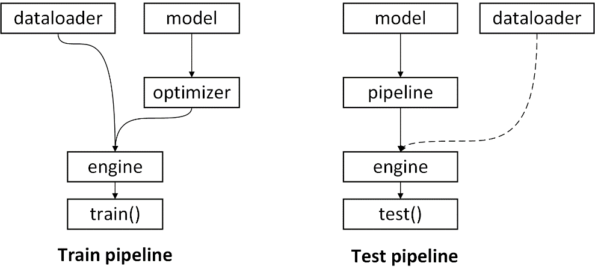
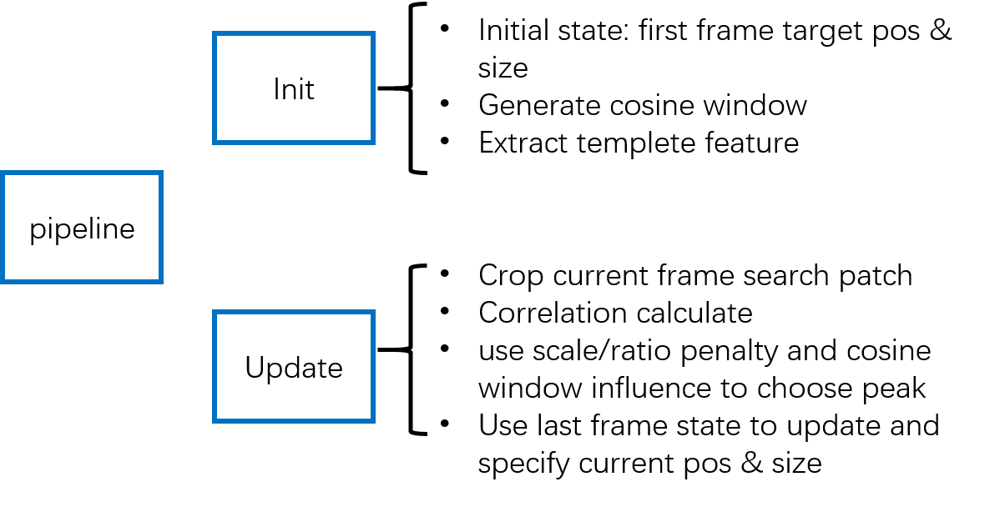
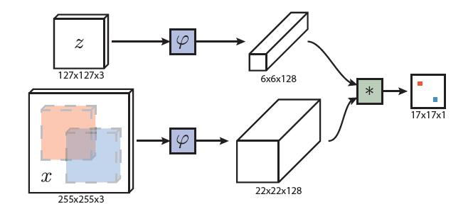
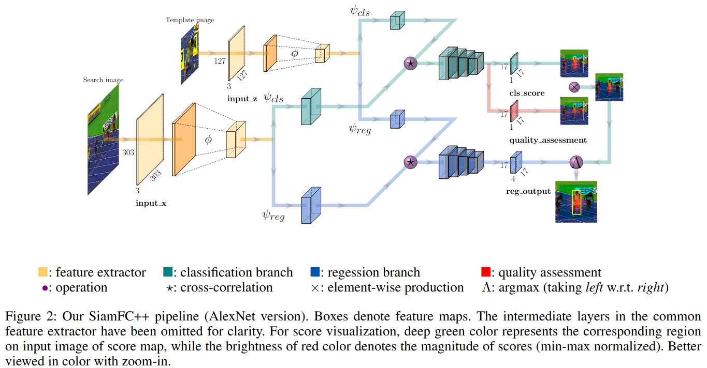
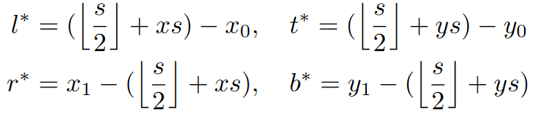
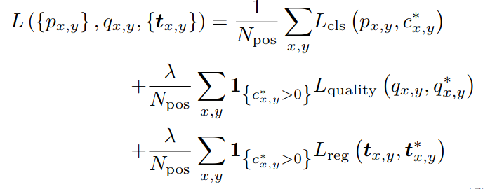

# 标注文档

本次标注任务针对旷世研究院公布的深度学习训练工程 VideoAnalyst 的单目标跟踪（SOT）部分。VideoAnalyst 基于 pytorch，以算法 SiamFC++ 和 SAT 为项目实例，构建了一套易于任务扩展的深度学习训练/测评框架。

本次标注涵盖工程框架结构梳理与 SiamFC++ 算法总结两方面，并对部分代码进行了补充注释。

## 工程框架架构梳理
  
该系统整体由 5 个模块构成：

  1. dataloader 模块提供训练数据；
     
  2. model 模块构建模型结构、初始化和损失函数等，构成模型的整体架构；
     
  3. optimizer 模块专注于模型（model）的训练细节，比如学习率调节 (lr schedule)、优化器参数 (optim method)、
     梯度调整 (grad modifier) 等；
     
  4. engine 模块中的 trainer 子模块控制一个epoch的训练流程，tester 子模块控制一个测试集的测试流程；
     
  5. pipeline 模块构建特定任务的处理流程，可以独立运行测试，或提供对外API接口。

系统配置架构示意图如下：

<br/>
<div align="center">

<p>系统配置架构示意图</p>
</div>
<br/>
<br/>

实现该系统架构的核心问题是：

  1. 如何在这 5 个模块中实现不同的任务；
   
  2. 如何对一个训练或测试流程进行合理的模块化配置。

为解决这两个问题，该工程采用 config 内容与代码模块一一对应的方式，配置即系统构建，整个工程在一套 config 配置树的规划下进行配置与开发；在各个模块内部，
采用注册器的形式将子模块进行注册以便于检索(对配置树及注册机制的说明参见 [docs/DEVELOP/DEVELOP.md](./docs/DEVELOP/DEVELOP.md)及相关代码的注释)。在此基础上，形成
了如下的项目整体架构。

```File Tree
project_root/
├── experiments  # experiment configurations, in yaml format (实验配置，网络的结构配置、数据集配置等等，
                                                              整个项目都会根据配置文件运行)
├── main
│   ├── train.py  # trainng entry point（训练入口，已经集成化了，当模块构建完成后，
                                         可直接运行 python3 main/train.py or test.py -cfg configfile.yaml）
│   └── test.py  # test entry point
├── video_analyst
│   ├── data  # modules related to data
│   │   ├── dataset  # data fetcher of each individual dataset
│   │   ├── sampler  # data sampler, including inner-dataset and intra-dataset sampling procedure
│   │   ├── dataloader.py  # data loading procedure
│   │   └── transformer  # data augmentation
│   ├── engine  # procedure controller, including traiing control / hp&model loading
│   │   ├── monitor  # monitor for tasks during training, including visualization / logging / benchmarking
│   │   ├── trainer.py  # train a epoch
│   │   ├── tester.py  # test a model on a benchmark
│   ├── model # model builder
│   │   ├── backbone  # backbone network builder
│   │   ├── common_opr  # shared operator (e.g. cross-correlation)
│   │   ├── task_model  # holistic model builder
│   │   ├── task_head  # head network builder
│   │   └── loss  # loss builder
│   ├── pipeline  # pipeline builder (tracking / vos)
│   │   ├── segmenter  # segmenter builder for vos
│   │   ├── tracker  # tracker builder for tracking
│   │   └── utils  # pipeline utils
│   ├── config  # configuration manager
│   ├── evaluation  # benchmark
│   ├── optim  # optimization-related module (learning rate, gradient clipping, etc.)
│   │   ├── optimizer # optimizer
│   │   ├── scheduler # learning rate scheduler
│   │   └── grad_modifier # gradient-related operation (parameter freezing)
│   └── utils  # useful tools
└── README.md
```

该工程按照配置即系统构建的设计原则，在配置文件中按照代码模块的实际分布进行相关参数的配置，使其集中化、逻辑化，训练和测试仅需要运行 python3 main/train.py or test.py -cfg configfile.yaml 即可，具体的
模块构建流程如图。

<br/>
<div align="center">

<p>模块构建流程图</p>
</div>
<br/>
<br/>

由于着重于多任务框架的设计和实现，遵守开闭原则 (Open–closed principle)，因此 video_analyst 具有非常好的多任务扩展属性，可通过添加自定义模块以实现新的工作。(自定义模块
的说明参见 [docs/TEMPLATES/README.md](./docs/TEMPLATES/README.md))

整个 tracking 的流程如下图所示：

<br/>
<div align="center">

<p>tracking 流程图</p>
</div>
<br/>
<br/>

## SiamFC++ 算法总结

通用视觉跟踪的目标是在给定有限信息(通常仅是第一帧的注释)的情况下，在视频序列中定位运动对象。追踪问题可以被视为分类任务和估计任务的组合，第一项任务旨在通过分类为目标提供可靠的粗略定位，
然后，第二项任务估计准确的目标状态，目标状态通常由边界框表示。值得注意的是，现代跟踪器用于第二项任务目标状体估计的方法差异很大，可以分为以下三个分支。

1. 其中一些方法，如判别相关滤波器(DCF) 与 SiamFC，使用多尺度测试来估算目标尺度。具体来说，通过将搜索图像重新缩放为多个比例并组装一个小批量的缩放图像，然后算法选择与最高分类得分相对应的比例作为当前帧中的预测目标
比例。该方法具有根本上的局限性，因为对边界框的估计本质上要求对目标姿势有高层次的理解，而且这类方法所做的“目标的尺度和长宽比率在相邻帧中以固定速率变化”这一假设通常并不现实。

2. 受 DCF 和 IoU-Net 的启发，ATOM 通过顺序地执行分类和估计来跟踪目标。对通过分类获得的目标的粗略初始位置进行迭代完善，以进行准确的追踪框估计。每帧边界框的多次随机初始化
以及迭代完善中的多次反向传播大大降低了 ATOM 的速度。该方法在准确性上产生了显著的改进，但是也带来了沉重的计算负担。此外，ATOM 引入了其他需要仔细调整的超参数。

3. 另一个以 SiamRPN 及其后续工作为代表的分支在负责特征提取的孪生网络后附加了区域提议网络（Region Proposal Network），该 RPN 子网络由两个分支组成，一个是用来区分目标和背景的分类分支，一个微调候选区域的
回归分支。但是论文指出，RPN 结构更适合于需要高召回率的目标检测，然而在单目标跟踪中，仅应跟踪一个对象。且 SiamRPN 检测的实质是对目标与搜索图像中的锚点进行匹配，而不是与搜索图像中的目标本身进行匹配，这可能会导致漂移并产生假阳性结果，从而导致跟踪失败，降低跟踪的鲁棒性。
且预设锚框的设计需要事先了解目标的尺寸和比例的数据分布，这与通用对象跟踪的目标背道而驰，阻碍了模型的泛化能力。
   
基于上述分析，论文为高性能通用对象跟踪器设计提出了一套准则：

1. 分离分类任务与目标状态估计任务。 跟踪器应执行两个子任务，分类与状态估计。没有强大的分类器，跟踪器就无法将目标与背景或干扰因素区分开，这会严重阻碍跟踪的鲁棒性。没有准确的状态估计结果，跟踪器的准确性则会从根本上受到限制。暴力的多尺度测试方法主要忽略了状态估计的任务，导致
效率与准确率的低下。
   
2. 无歧义评分。 分类的分数应该直接表现出目标存在于“视野”中的置信度，而不是目标在预设的锚框中的置信度，对象与锚框之间的匹配容易产生假阳性结果，从而导致跟踪失败。

3. 无先验信息。 跟踪方法应该不使用目标的尺寸、比例分布这样的先验知识,以提升模型的泛化能力。

4. 评估目标状态估计结果的质量。 将分类置信度用于最终的边界框选择会导致性能的下降，应该使用一个独立于分类的对目标状态估计结果的评分机制。

根据上述准则，论文设计了基于全卷积孪生跟踪器（Fully-convolutional Siamese Trackers，siamFC）的 SiamFC++ 方法。SiamFC++ 添加了一个并行于分类头的回归头，用于精确的目标状态估计（满足准则 1），未采用预定义的锚框（满足准则 2，3），最后，添加了一个状态估计评估分支以用于选取高质量的边界框。下面对 SiamFC++ 框架进行详细描述。

首先对 SiamFC（Fully-Convolutional Siamese Networks for Object Tracking）进行简要介绍，SiamFC 的网络结构如下图。
<br/>
<div align="center">

<p>SiamFC 网络结构</p>
</div>
<br/>
<br/>
图中的 φ 为用于通用特征提取的孪生主干 CNN 网络，上下两个分支使用的 CNN 结构相同，参数完全共享。
z 和 x 分别是要跟踪的目标模版图像和新的一帧中的搜索范围，二者经过同样的 CNN 编码器后得到各自的特征图，然后对二者进行互相关运算后得到一个 17x17x1 的响应图。
响应图每一个像素的值对应了搜索区域 x 中与目标模板图像 z 等大的一个对应区域出现跟踪目标的概率，将概率最大的位置乘以步长即可得到当前目标的位置。

SiamFC++ 基于 SiamFC，并根据所提出的准则逐步完善自身,网络结构如下图所示。
<br/>
<div align="center">

<p>SiamFC++ 网络结构</p>
</div>
<br/>
SiamFC++ 由用于特征提取的孪生子网络与用于分类和回归的区域提议子网络构成，相对于 SiamFC 增加了用于目标状态估计的回归分支与状态估计评估分支。下面从 4 条
准则方面对 SiamFC++ 的实现进行描述。

遵循准则 1（分离分类任务与目标状态估计任务），SiamFC++ 设计了分类 head 与回归 head 对互相关运算结果进行预测。分类 head 将 ψ<sub>cls</sub> 作为输入，对最终得到的特征图上的每个点的分类就是对原图上对应 patch 的分类；而回归 head 将 ψ<sub>reg</sub> 作为输入，输出一个额外的偏移量回归，来优化边界框位置的预测。（ψ<sub>cls</sub>、ψ<sub>reg</sub> 指 task-specific feature）

对于分类任务，如果特征图 ψ<sub>cls</sub> 上的位置 (x , y) 在输入图像上的对应位置 (⌊s/2⌋ + xs, ⌊s/2⌋ + ys) 落入 ground-truth bbox 内，则将其视为正样本，s是backbone的步长（s = 8）。
对于特征图 ψ<sub>reg</sub> 上每个正样本 (x, y) 的回归，回归 head 最后一层预测输入图像上对应位置 (⌊s/2⌋ + xs, ⌊s/2⌋ + ys) 到 ground-truth bbox 四条边的距离，并将其表示为一个四维向量 
t<sup>∗</sup>= (l<sup>∗</sup>,t<sup>∗</sup>,r<sup>∗</sup>,b<sup>∗</sup>)。

<div align="center">

</div>

其中 (x<sub>0</sub>, y<sub>0</sub>) 和 (x<sub>1</sub>, y<sub>1</sub>) 表示 ground-truth bbox 左上角和右下角的点。

遵循准则 2（无歧义评分），SiamFC++ 直接对特征图像素点对应的图像 patch 进行分类，并在该位置回归目标边框，即直接将位置视为训练样本。而基于锚点的目标跟踪将输入图像上的位置视为多个锚框的中心，在同一个位置会输出多个分类得分，并根据锚框回归目标边界框，这导致了每个位置的歧义性。SiamFC++ 分类头最终输出的特征图上每个像素的预测值（分类得分）直接表示出目标存在于对应图像 patch 的置信度。

遵循准则 3（无先验信息），SiamFC++ 没有预设的锚框和阈值等先验信息。

遵循准则 4（评估目标状态估计结果的质量），如果直接使用分类得分来选取最终的边界框，会导致定位准确性的下降，因为之前研究表示分类置信度与定位准确性没有很好的相关性，因此 SiamFC++ 添加了一个
质量评估分支并行于分类 head，该分支的输出用于估计 Prior Spatial Score，也可用于预测 IoU 得分，以提升定位准确性。

最终训练目标如下图所示：

<div align="center">

</div>

其中 1· 是 0-1 分布的，即只对目标位置（正样本）进行计算。L<sub>cls</sub> 表示分类的 focal loss， L<sub>quality</sub> 表示质量评估的交叉熵损失，L<sub>reg</sub> 表示预测边框的IoU损失。


## 标注参考文档

[SiamFC++ 论文原文](https://arxiv.org/pdf/1911.06188.pdf)

[siamfcpp代码讲解 - bilibili](https://www.bilibili.com/video/BV1Hp4y1S74D)

[漫谈视频目标跟踪与分割 - 旷视科技的文章 - 知乎](https://zhuanlan.zhihu.com/p/114743420)

[video_analyst项目搭建与siamfc++小结 - CSDN](https://blog.csdn.net/PAN_Andy/article/details/105345598)

[单目标追踪论文阅读系列（二）——《SiamFC++（AAAI 2020）》 - 零维的文章 - 知乎](https://zhuanlan.zhihu.com/p/93888180)

[SiamFC++: Towards Robust and Accurate Visual Tracking with Target Estimation Guidelines 论文学习](https://blog.csdn.net/PAN_Andy/article/details/104584807/)

[SOT入门之Siam系列（二）：SiamFC++ - 于恩的文章 - 知乎](https://zhuanlan.zhihu.com/p/107908399)